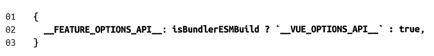

# 第 2 章: 框架设计的核心要素
## 2.1 提升用户的开发体验
- 提供友好的警告信息，帮助用户快速定位问题
- 提供输出格式自定义配置，输出 log 更加友好（比如 initCustomFormatter 函数用来自定义 ref log 的展示输出格式）

## 2.2 控制框架代码的体积
- 良好的开发体验 与 优秀的框架体积与加载速度 的权衡问题：
    - 2.1 中提出的，更友好的提示信息，更友好 log 信息，就意味着更多的逻辑，更多的提示文本，意味着更大的体积
    - 而对于一个框架来说，体积越小，加载的时间就会越少，体验就会越好
    - 以上两种角度是相悖的
- 因此，Vue.js 区分了**开发环境与生产环境**，这样既保证了开发过程中的开发体验，又保证了实际生产环境中的体积以及性能
    - 看 vue 的 log 日志源码中，基本都区分了环境， 通过_DEV_常量进行区分：
    

## 2.3 框架要做到良好的 Tree-Shaking
- 背景：2.2 中提出通过区分环境来构建不同产物，从而控制体积，而这些还是不够的，因此引入的 Tree-Shaking 的方案

- Tree-Shaking 指消除那些永远不会被执行的代码，即删除 dead code
    - 必要条件：模块必须为 ESM （因为 Tree-Shaking 依赖 ESM 的静态结构）
    - 必要条件补充说明：rollup 可以通过插件 导入现有的 CommonJS 模块
    - 何为 dead code:  从来没有被使用的代码
    - 副作用：如果一个函数调用会产生副作用，则不能将它移除。即使他只是 read value，如果他是 proxy，也有可能会因此出发 proxy 的 get 钩子，产生副作用，因此无法移出
    - 显示声明告知无副作用的代码：采用注释 /*#_PURE_*/
    - 因此，vue3 源码中采用了大量的无副作用注释来优化 tree-shaking 的效果，一般都是在顶级调用函数上

## 2.4 框架应该输出怎样的构建产物
- 产物格式(需求不同，用法不同，产物不同)：
    - iife
        - Immediately Invoked Function Expression 立即调用的函数表达式
        - 使用场景：使用 script 标签直接引入 vue 资源并使用时，需要在引入的 js 文件中直接自执行，比如 vue.global.js 以及 vue.global.prod.js
        
        - 配置: 在 rollup.js 中，通过 output 中的 format:'iife'来配置表示：      
        
    
    - esm
        - es module
        - 使用场景：现在主流浏览器对于原生 ESM 的支持不错，可以使用 script type=“module” 标签直接引入 esm
        - 配置: 在 rollup.js 中，通过 output 中的 format:'esm'来配置表示
        - vue 自身 esm 会有两块：
            - vue.esm-browser.js: 直接给浏览器 script type="module" 标签使用的 esm，通过 _DEV_ 来区分不同环境
            - vue.esm-bundler.js: 给 rollup.js 或 webpack 等打包工具使用的 esm, 通过 process.env.NODE_ENV 来区分环境，支持用户通过配置决定目标环境

    - cjs
        - CommonJS
        - 使用场景： 使用在 node 环境而非浏览器环境，通过 const Vue = require('vue') 使用
        - 配置: 在 rollup.config.js 中，通过 output 中的 format:'cjs'来配置表示

## 2.5 特性开关
Vue 中有很多特性开关

### 特性开关的优势
- 精准的体积控制：用户关闭的特性，tree-shaking掉
- 为框架设计带来灵活性
    - 新增特性，不用担心不需要的老用户资源体积变大
    - 升级后的遗留 API, 不用担心新用户的资源体积变大

### 特性开关的实现
-  和__DEV__本质一样，采用 rollup.js 的预定义常量插件来实现

- 举例： __VUE_OPTIONS_API
    - 作用：让 vue3 中也能兼容 vue2 的选项式 API 方式编码，如果你不需要，可以在插件配置中关闭该特性，从而实现减小体积优化性能的效果
    - 

## 2.6 错误处理与健壮性
错误处理是框架开发过程中非常重要的环节。
好的框架错误处理机制可以提升应用程序的健壮性，同时降低用户开发时处理错误的心智负担。

- 方式一：让用户自行在自己的每一个函数中 try catch ❌❌❌（冗余，用户心智负担大）
- 方式二：框架设计者代替用户在每一个导出方法中 try catch ❌❌（框架内代码冗余）
- 方式三：框架设计者封装统一的错误处理函数 callWithErrorHandling + 注册统一错误处理程序 registerErrorHandler
    - 这样错误处理能力完全由用户控制，用户既可以选择忽略，也可以进一步操作
    - Vue 中注册统一错误处理函数：
        - 

## 2.7 良好的 Typescript 支持
- TS 编写代码 和 TS 类型支持友好 是两回事
