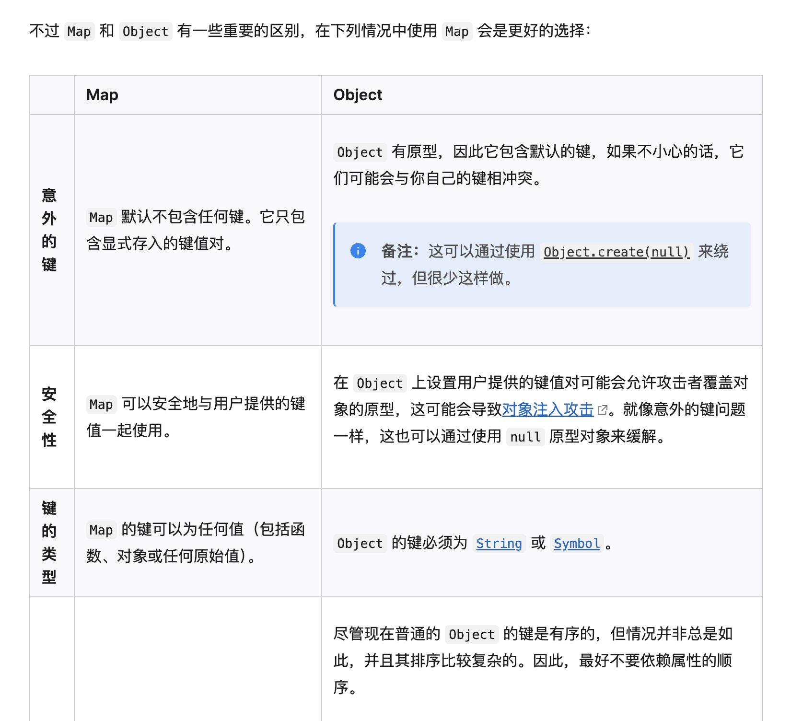
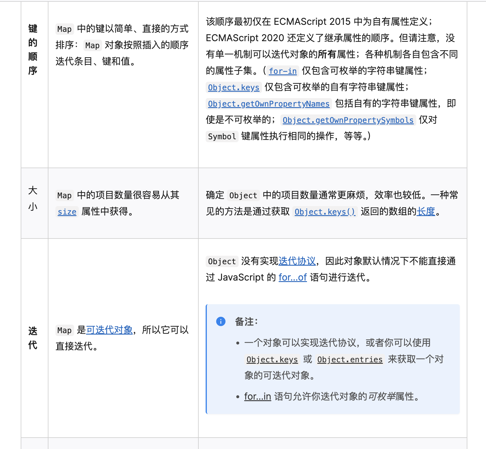
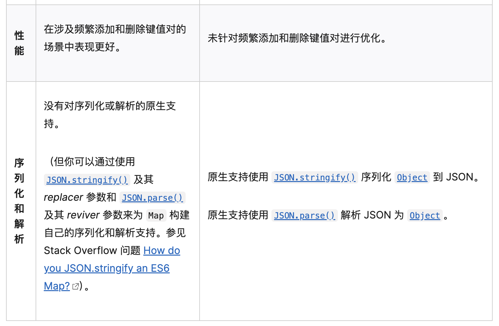
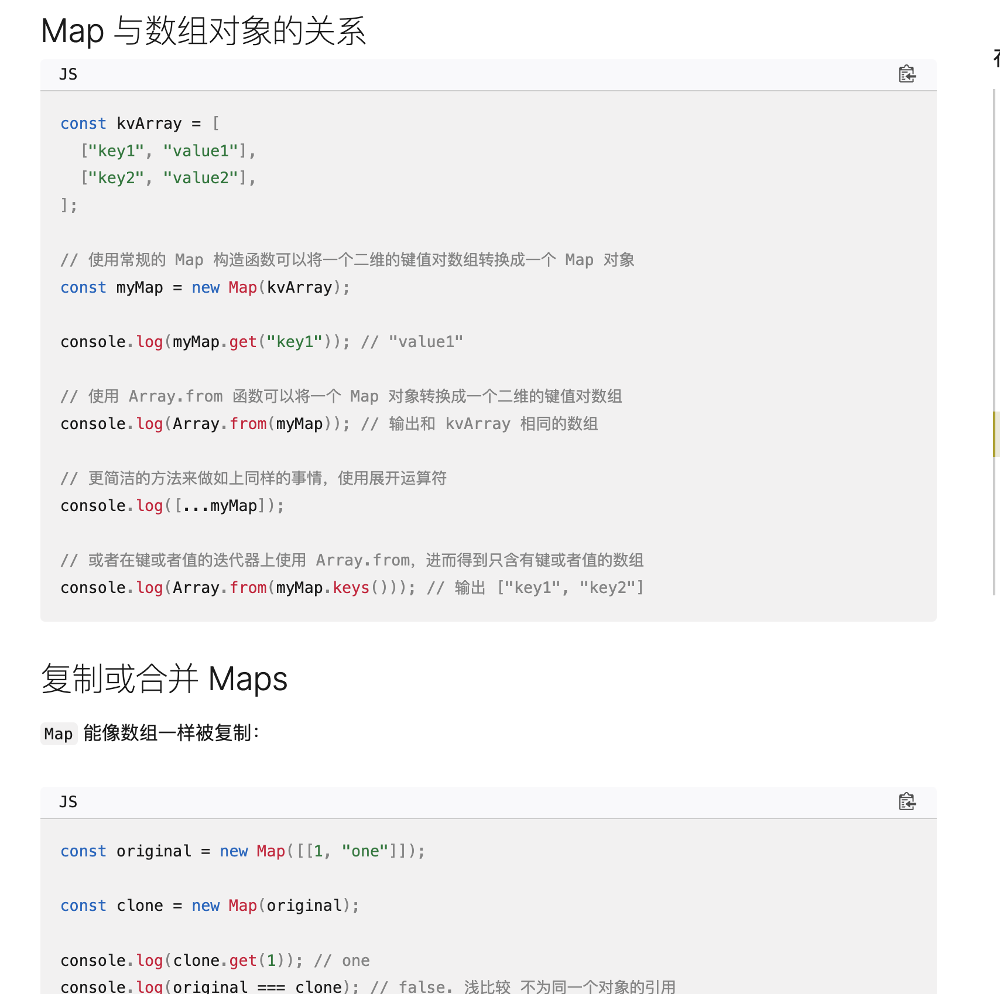

# 参考资料
https://developer.mozilla.org/zh-CN/docs/Web/JavaScript/Reference/Global_Objects/Map
https://juejin.cn/post/7374685303884562484
https://programmercarl.com/%E5%93%88%E5%B8%8C%E8%A1%A8%E7%90%86%E8%AE%BA%E5%9F%BA%E7%A1%80.html#%E5%93%88%E5%B8%8C%E5%87%BD%E6%95%B0

# map
map 是键值对的集合，键和值可以是任何类型。（object 的键只能是 string/symbol 或者数字）
在 js 中，map 中的键值是有顺序的，而 object 中的键值是无序的。（object 中后续在新的 ecmascript 标准中，键值对也变得有序了，但是早起的不一定有序）
规范要求 map 实现“平均访问时间与集合中的元素数量呈次线性关系”。
因此，它可以在内部表示为哈希表（使用 O(1) 查找）、搜索树（使用 O(log(N)) 查找）或任何其他数据结构，只要复杂度小于 O(N)。
但是如果出现哈希冲突，会根据内部具体的哈希碰撞解决方式导致时间复杂度的增加。
如果是链表形式解决时间复杂度会退化到 O(n); 如果是红黑树形式解决时间复杂度会退化到 O(logn)。

## 哈希碰撞
当多个内容有相同的哈希值时，就会发生哈希碰撞。

### 链表法
将哈希值相同的元素存储在链表中。这样就可以通过索引+链表的方式找到对应的元素。
时间复杂度退化为 O(n)。

### 线性探测法
当发生哈希碰撞时，会通过某种方式找到下一个空闲的哈希地址。
时间复杂度退化为 O(logn)。

