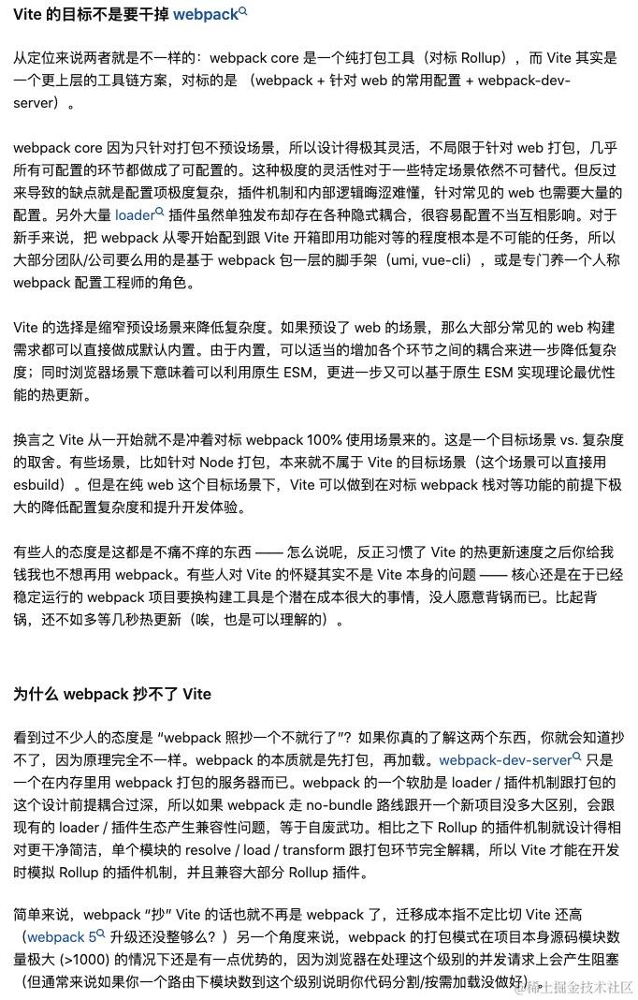

# 1. Vue2.6 Vue2.7 Vue3 版本兼容问题

## 问题背景，为什么要做一套 vue2 vue3 uniapp 兼容的 uikit

外部挑战是中小型客户对于 Vue2 UIKit 和 Uniapp Vue2 版本的需求强烈。
内部挑战降本增效的人力问题，UIKit 所有框架加起来也就能有三个人力。如果按照之前每个框架（包含 Vue2 & Vue3 各做一套），人力根本无暇顾及。
第一版 TUIKit 只有 Vue3 和 Uniapp Vue3 两个版本，就需要分别占用两个人力来维护。
但是我们做 SDK + UIKit 加起来一共就只有五个人力。
所以准备做一套全新的 UIKit 2.0 版本，在框架层面同时支持原生的 Vue2 & Vue3， 以及 Uniapp Vue2 & Vue3。

## 实现思路：封装 adapter-vue ，磨平差异

关于 Vue2.6 & Vue2.7 & Vue3 版本兼容，我们是封装了一个 adapter-vue 来进行兼容实现。
adapter-vue 的实现思路是：
参考 vue-demi 的实现思路，在安装期，该库使用了npm的postinstall钩子。安装完毕所有依赖后，脚本会检查本地依赖的vue版本，然后根据本地vue版本确定导出的api。

1. UIKit 内部所有的 Vue api，都是从 adapter-vue 中进行引入的。
2. 在 adapter-vue 中，根据不同的 Vue 版本，从不同的源中导出 api：
    - Vue2.6 版本采用的是 @vue2 + @vue/composition-api 的源
    - Vue2.7 和 Vue3 版本都已经默认内置 @vue/composition-api, 所以直接从 vue@3 中导出

## 兼容实现细节处理

3. 还有一些小细节：
    - 除了导出源不一样的问题，还有什么兼容问题呢？
        - 整体的原则采用的是短板优先的策略：
            - 我们之前的源切换只能磨平 vue2 vue3 composition api 的差异，但是 vue2 和 vue3 的差异还是很大的，所以需要采用短板优先的策略，优先兼容 vue2 的差异
            - 比如：
                - 销头：vue3 中新支持的 多根节点语法、Teleport、Suspense、Fragment 等，这些在 vue2 中都是不支持的，要避免使用
                - 补尾：还有一些vue2因为响应行原理造成的响应丢失问题，比如：
                    - 对象新增属性删除属性
                    - 数组新增删除元素
                    - 数组直接赋值
                - 这些需要在 vue3 中增加 vue.set 和 vue.delete 的 api 来磨平，这个set 和 delete就很普通了，就是给target[key] = value 和 delete target[key] 进行兼容实现. 在 vue2 中就直接采用 vue 原生的 set 和 delete 来实现

    - 内部是如何判断 Vue 版本？
        - 通过直接引入整个 default vue 库，如果引入后有 version，可以通过 default.version.startsWith('2.6'/'2.7') 来判断
        - vue3 是没有默认导出的，所以没有默认导出的情况下认为就是 version3

    - adapter-vue之后可以写vue3代码打包成vue2了，但是某些细微响应性失效问题？
        - 因为我们都知道，在 vue2 中，响应性是基于 Object.defineProperty 实现的，而 vue3 是基于 Proxy 实现的。
        - 而 Object.defineProperty 是基于 getter 和 setter 实现的，是对 object 的属性进行劫持
        - 而 Proxy 是基于 Reflect 实现的，是对整个 object 进行劫持
        - 所以 vue2 中的响应性存在缺陷，也就是当对象新增属性删除属性的时候，vue2 无法监听到，所以 vue2 中需要使用 $set 和 $delete 来手动触发响应性
        - 而 vue3 中，由于是基于 Proxy 实现的，所以可以监听到对象的新增和删除属性，所以 vue3 中不需要使用 $set 和 $delete 来手动触发响应性
        - 所以需要在 adapter-vue 中，对 vue2 的 $set 和 $delete 进行兼容实现，给 vue3 也暴露 $set 和 $delete 的 api

    - 技术选型方面的问题：具体的组件代码是采用的 SFC(也就是模版语法)、还是采用的 JSX(也就是函数式组件)、还是采用的渲染函数(也就是 render 函数)？
        - 我们知道，其实现在 react 组件库大部分都是采用 JSX 的语法来实现的，vue 中其实也可以采用标准的 jsx 语法
        - 为什么不选标准 JSX 语法？ 因为要跟 uniapp 兼容，uniapp根本不支持 JSX 语法。也就是平台限制。
        - 又调研了 Vue2 & Vue3 的渲染函数 render() 和 h() 的实现，发现 Vue2 和 Vue3 的实现方式是不同的，Vue2 的 render() 是基于原生 DOM 的实现，而 Vue3 的 render() 是基于虚拟 DOM 的实现, 使用方式和实现原理都不同，差异过大，放弃。
        - 所以只能采用 SFC 的语法来实现，也就是模版语法来实现。不过幸好，SFC 一直是 Vue 的官方推荐语法，所以可以放心大胆的采用。

    - SFC 模版语法上也有优化，使用了 vue3 的 script setup 语法，可以简化代码，提高开发效率
        - 但是 script setup 语法在 vue2 中是不支持的，调研之后选择了 antfu 的 unplugin-script-setup-vue2 插件来实现 vue2 中也支持 script setup 语法

    - 三方库选型问题？
        - 由于这个限制，UI 层面的组件基本全部自研 SFC 语法来实现
        - 三方库也都尽可能的选择与 框架无关的，采用原生 js 实现的，比如我们的 profile 组件中有一个日期选择 datepicker，就采用的是一个 vanilla-picker 的库，这个库是基于原生 js 实现的，所以可以兼容 uniapp
        - 目前是没有vue强相关的库的，如果需要的话，比如引入element，element在 vue2 vue3上是两个库，一个是 element-ui, 一个是 element-plus，思路也是一样的，也是需要通过 adapter 层磨平差异之后统一暴露

## 延伸问题

vue2 和 vue3 的区别是什么呢？

### 1. 响应性

本质上都是采用发布订阅的模式，在访问数据时进行依赖收集，放在 observer 中，当数据发生变化时，通知 watcher 进行更新。
但是 vue2 和 vue3 的响应性实现原理是不同的，vue2 是基于 Object.defineProperty 实现的，而 vue3 是基于 Proxy 实现的。
Object.defineProperty 顾名思义，是对 object 的属性进行劫持。在 vue2 中的 data 初始化时就要遍历对象的所有属性来进行劫持。那新增的属性肯定就劫持不到了，所以 vue2 中需要使用 $set 和 $delete 来手动触发响应性。
同时，Object.defineProperty 本身是无法监听到数组的变化的，所以 vue 中重写了 array 的 push、pop、shift、unshift、splice、sort、reverse 这些方法，来监听数组的变化。
Proxy 是对整个 object 进行劫持，所以新增的属性也可以监听到。也支持对任何数据类型进行监听。不需要初始化时遍历每一个属性。

### 2. 组件使用写法

- Vue2：
  - 主要使用 Options API
  - 代码组织按照 options 分类（data、methods、computed等）
  - 复用逻辑主要通过 mixins 实现
- Vue3：
  - 推荐使用 Composition API
  - 代码组织更灵活，可以按照功能逻辑分组
  - 提供了 setup 语法糖
  - 通过组合式函数（composables）实现逻辑复用

### 3. 性能优化

Vue3 相比 Vue2 有显著的性能提升：

- 响应式升级
  - vue2中，需要在初始化的时候递归遍历所有的属性进行 Object.defineProperty 的劫持，所以性能较差
  - vue3中，采用了 Proxy 的实现，不需要在初始化的时候递归，只有在访问属性的时候才会进行代理，所以性能较好
- 更好的 Tree-shaking 支持
  - vue2中，全局 API 都会被挂在 Vue 实例上，比如 vue.nextTick(), 不管用不用都没有办法被 tree-shaking 掉
  - vue3中，全局 API 都是通过 import 按需引入的，所以可以被 tree-shaking 掉，做到了可以只打包用到的 vue 的功能。
- 虚拟 DOM 重写，渲染性能提升
  - 虚拟 dom 是对真实 dom 的抽象，将这个 dom 的信息抽象成一个对象，通过现在 js 层面统一的操纵虚拟 dom 对象，最后再通过 diff 算法，将虚拟 dom 对象转换成真实 dom 对象。
  - 有了虚拟 dom，可以解决直接操作 dom 引发的超高频次重绘、回流问题，从而提升性能。
  - vue2 中的虚拟 dom 只存储 dom 的信息描述，包括 tag， props， children 等信息，采用 createVNode 来创建虚拟 dom 对象

    ```javascript
    // Vue2
    function createVNode(tag, props, children) {
        return {
            tag,
            props,
            children,
            // 所有属性都需要进行 diff
            // 没有优化标记
        }
    }
    ```

  - vue3 中的虚拟 dom 包含了更多标记信息用于 diff 的优化，提升 diff 的性能
    - 增加 patchFlag 标记，标记动态内容， diff 的时候只 diff 有 patchFlag 标记的节点， patchFlag 不同value代表的是不同的更新类型，比如 pacthFlag 1 就代表的是动态文本节点，直接触发后续的 text content 更新
    - 增加 dynamicProps 标记，标记哪些属性是动态的，diff 遍历 props 的时候只在 dynamicProps 中进行遍历对比

    ```javascript
    // Vue3
    // 示例：一个组件的虚拟节点
    const vnode = {
        type: 'div',
        props: {
            id: 'static-id',      // 静态属性
            class: 'dynamic-class', // 动态属性
            style: 'color: red'    // 动态属性
        },
        patchFlag: 6,           // CLASS(2) + STYLE(4) = 6
        dynamicProps: ['class', 'style'] // 记录哪些属性是动态的
    }
    ```

- diff 算法的优化
  - vue2: 采用双端队列进行比较，newStart，newEnd，oldStart, oldEnd 进行两两对比，如果相同就 patch 新旧 VNode，之后进行移动进行下一次对比。如果这四个指针两辆交叉都没匹配上，就需要遍历查找旧树中有没有，有的话进行 patch，没有的话就创建新节点
  - vue3:
    - 本身增加 patchFlag / dynamicProps / block 标记, 大大缩小需要执行 diff 算法的范围
    - 采用 map 存储有 key vnode 的key值，这样查找时间复杂度为 O(1)
    - 采用最长上升子序列优化 diff 算法, 将 diff 算法的时间复杂度从 O(n^2) 降低到 O(nlogn)

- 编译优化，静态节点会被提升
  - vue2 中，即使是一个完全不会变化的静态节点，每次也会被重新创建在 new tree 中与 old tree 进行diff。
  - vue3 中，静态节点会被提升，不会进行 diff 操作，也会直接被复用，不需要重新创建，所以性能较好

- block 树
  - vue2 中，没有 block 树的概念，所以每次渲染的时候都会进行 diff 操作，性能较差
  - vue3 中，采用了 block 树的概念，将节点分为静态节点和动态节点，静态节点会被提升，动态节点会被收集到叫做 dynamicChildren 中, 拥有 dynamicChildren 的节点叫做 block。通过 block  的dynamicChildren 和 patchFlag 来判断哪些节点需要进行 diff 操作，哪些节点需要进行更新。

- 支持 Fragment
  - vue2 中，组件的根节点只能有一个，所以需要使用 div 包裹
  - vue3 中，组件的根节点可以有多个，所以支持 Fragment, 减少不必要的节点嵌套

- 事件监听缓存优化
  - vue2 中，每次重新渲染都会创建新的事件监听函数，比如 onclick
  - vue3 中，事件监听函数会被缓存，之后调用的时候从 cache 中获取，所以性能较好；当然，当组件销毁的时候，缓存也会被一起清理。并且 vue3 中采用的是 WeapMap 来存储缓存，WeakMap 是弱引用，当对象被销毁时，缓存也会被销毁，会自动的被垃圾回收掉，所以不用担心内存泄漏问题。

### 4. TypeScript 支持

Vue3 使用 ts 进行重写，提供更好的类型推导

### 5. 新特性

- 多根节点语法（Fragment）
- Teleport
- Suspense
- Composition API
- setup 语法糖

### 6. 生命周期变化

- Vue3 新增了 setup 生命周期，在所有生命周期的最前面，类似于 vue2 的 beforeCreate 和 created 生命周期
- Vue3 移除了 beforeDestroy 和 destroyed 生命周期，取而代之的是 onBeforeUnmount 和 onUnmounted

----------------------------------------------------------------------------------------------------------------------------------------------------------------------------------------------

# 2. 浏览器环境下的原生 Vue 和 Uniapp 多端框架 的 兼容问题

## window 与 uni 对象的差异

- 浏览器环境中都是 window 和 document 对象，但是 uniapp 中其实是没有的，都是 uni 对象
- 所以封装了一个叫做 TUIGlobal 的全局对象，用来存储这些差异
- TUIGlobal 在普通的 web/h5 环境中，就是 window 对象
- 在 uniapp 中，就是 uni 对象

## 环境判断

TUIGlobal 中除了导出切换全局对象，还提供了一些环境判断的 api
    - isBrowser 判断是否是浏览器环境
    - isUniapp 判断是否是 uniapp 环境
    - 对于 isBrowser 满足时，又可以继续通过 window.navigator.userAgent 来判断是哪个浏览器,是 android h5 还是 ios 还是harmony 还是 winphone 等等
    - 对于 isUniapp满足时，这个时候是获取不到 userAgent的，不过好在 uniapp 内部给我们磨平了这块逻辑，可以采用 uni.getSystemInfo 来获取这些平台信息

## dom 操作

此外，除了环境判断的 api，还提供了一些公共工具函数
    - 比如，获取 dom 元素的 api，我们直接在 web 中使用的时候可能 document.querySelector 就可以获取到 dom 元素，但是在 uniapp 中，需要采用 uni.createSelectorQuery 来获取 dom 元素, 所以需要封装一个公共的 getDomElement 函数来获取 dom 元素
    - 同样的，dom相关的 scrollInfo 也是需要封装一个公共的 getScrollInfo 函数来获取
        - 在 web 中，我们获取到节点之后，直接调用节点.getBoundingClientRect() 就可以获取到节点的 scrollInfo
        - 在 uniapp 中，需要采用 uni.createSelectorQuery 来获取节点 node，之后通过 nodesRef.scrollOffset(callback) 回掉的形式获取节点 scroll 相关信息

## 媒体上传

文件上传类 api：
    - 文件上传类 api 需要兼容 web 和 uniapp 的差异，web 中采用 input file 来上传文件，当文件上传时，会触发 change 事件，而 uniapp 中是采用的 uni.chooseVideo uni.chooseMedia 来上传文件

----------------------------------------------------------------------------------------------------------------------------------------------------------------------------------------------

# 3. 逻辑层的抽离统一

在 toC 的项目中，vue 项目一般都会使用 vuex / pinia 这些三方状态管理工具，作为整个项目的状态管理。
在 toB 的基础组件库中，一般不会直接采用三方状态库来实现，而是采用内部实现，比如对于组件内的小变量采用 ref reactive 来维护，对于整个组件的公共数据采用 provide inject 或者是封装一个统一的 storeManager 来维护；对于组件间的通信采用顶层 storeManager 或者 eventbus 来实现。

我们项目虽然也是组件库，但是和普通的基础组件库不同，有非常重的业务逻辑，并且内部包裹了与整个腾讯云IM 后台的交互，所以需要一个统一的逻辑层来维护这些逻辑。

整体还是采用的发布订阅模式，抽离一个 TUIStore 来维护整个 chat 相关的业务数据，store 上有几个模块，conversation、chat、group、user、friend 模块等。每个模块内部维护自己的数据，比如 chat 模块内部维护的消息列表 messageList，实际上 messageList 的变动需要监听 chat js sdk 的十几种事件，比如message receive、message modify、message delete、 message_fail 等等来进行数据更新。通过 store 的 update 和 watch 来实现数据更新和监听。

----------------------------------------------------------------------------------------------------------------------------------------------------------------------------------------------

# 4. pnpm + monorepo 工程化

上面已经分析了，项目中包含 uikit 的不同版本的多个包、TUIGlobal 全局 api 抹平包、 TUIEngine 业务逻辑包等那么多个包，还包含本身最基础的 js chat sdk。同时还有上面我没提到的，兄弟团队合作的音视频通话能力、会议能力等相关的包。本地多包管理和测试就成了一个大问题。

这些包之间层层依赖，对应多个场景、多个 vue 版本以及框架的 demo 测试，所以需要一个包管理工具来管理这些包。

采用了 pnpm + monorepo 的包管理方式，来管理这些包。

monorepo 就是用来进行大型项目下的单仓库多项目管理的。
pnpm 又天然支持 monorepo，所以采用 pnpm 来管理这些包。

如果不放在一个仓库中，那其中一个包的修改，测试和调试都变得非常麻烦。

## 为什么选择 pnpm

- 磁盘空间和安装速度的优化：通过使用硬链接和符号链接，pnpm 能够显著减少项目的磁盘空间占用和安装时间。
- 更严格的依赖关系管理：pnpm 更严格地遵循包的依赖关系，确保您的应用程序只访问在其package.json中声明的依赖项。
- 原生 Monorepo 支持：通过 pnpm workspaces 功能，pnpm 支持原生 Monorepo，使跨项目的包管理变得更加简单

## Monorepo 的优点

- 代码共享和复用：在单一代码库中，不同项目和模块可以轻松地共享和复用代码，降低了重复开发的成本。
- 依赖管理：Monorepo 可以使开发人员更容易地管理项目间的依赖关系，减少了版本冲突和升级问题。
- 原子提交：Monorepo 允许开发人员在一个提交中更新多个项目或模块，这有助于保持代码的一致性。
- 更简洁的工作流程：使用 Monorepo 可以简化构建、测试和部署等工作流程，提高开发效率。

## Monorepo 的缺点

- 代码库规模：随着项目和代码的增长，Monorepo 的规模可能变得庞大，从而影响性能和存储需求。
- 权限管理：在一个大型代码库中管理访问权限可能变得复杂，特别是在多团队协作的情况下。
- 潜在的耦合：由于代码位于同一仓库中，可能导致不同项目之间的耦合过于紧密，影响项目的独立性和灵活性。

## pnpm workspace

- 项目中通过 pnpm workspace 协议来管理本地包。
- 在 pnpm-workspace.yaml 文件中，配置了需要管理的包，以及包的依赖关系。

```js
packages:
    - 'tuikit/**'
    - 'samples/**'
    - 'universal-api/**'
    - 'universal-component/**'
```

- 在 sample 和 uikit 的 package.json 文件中，配置了依赖关系。
本地包一般是采用 pnpm add 进行加入

```js
{
  "dependencies": {
    "@tuikit/engine": "workspace:*",  // 使用 workspace 协议
    "@tuikit/uikit-vue3": "workspace:*"
  }
}
```

- 采用 pnpm workspace 来管理本地包，可以实现本地包的共享，比如 uikit 的包可以使用 TUIGlobal 包和 TUIEngine 包。 而 uikit 包有可以被一系列 sample 进行使用。

## pnpm / npm / yarn 的区别

pnpm，全称为performant npm，意为高性能的Node.js包管理器，由Zoltan Kochan 于2017 年发布，具有速度快、节省磁盘空间的特点。

- 结构
  - npm / yarn 采用的是扁平式的结构，所有的层层依赖都会被扁平的放在 node_modules 中，这样会产生幽灵依赖问题，就是我可以直接访问我依赖的包内部依赖的其他包。
  - pnpm 采用的是嵌套式的结构，所有的依赖都会被放在 node_modules 的全局存储的 .pnpm 文件夹中，这样就避免了依赖的重复安装，同时也避免了依赖的冲突

- 存储方式
  - <https://juejin.cn/post/7098260404735836191#heading-5>
  - npm & yarn，安装依赖时一般是下载该依赖的tar包到本地离线镜像，然后解压到本地缓存，最后再将其拷贝到项目的node_modules中。
  - 如果有100个项目，并且这100个项目都有一个相同的依赖包，那么这100个项目的node_modules中都保存有这个相同依赖的副本，也就是说硬盘上需要保存100份相同依赖包的副本。
  - pnpm 采用的是硬链接的方式，所有真正的包都会放在统一的 pnpm 存储空间中，并且只存在一份。而 pnpm 仓库顶层的 node_modules/.pnpm 中存放的是指向这块内存地址的硬链接，并不会真正的拷贝一份依赖包。除了 .pnpm 文件夹，其他文件夹都是软链接，保持和 package.json 一样的嵌套结构，软链接是创建一个指向依赖包的符号链接，这样就避免了依赖的重复安装，同时也避免了依赖的冲突。

### 举例 模拟 安装依赖时

pnpm install lodash

1. 检查 store 中是否存在 lodash
2. 不存在则下载到 store
3. 在项目中创建硬链接指向 store
4. 创建软链接构建依赖树

### 在 package 中开发如何能在 test 中实时看到效果

- test 中需要依赖的是本地包 workspace

- <https://gengxiaofei.com/fe/project/monorepo-pnpm/index.html#%E7%9B%91%E5%90%AC-package-%E5%8F%98%E6%9B%B4>

- 执行 pnpm --parallel -r run watch 会：
  - 同时启动所有包的 watch 命令
  - 并行监听所有包的文件变化
  - 各包独立编译和热更新
- 这个命令特别适合：
  - 开发多个相互依赖的包
  - 需要实时编译和热更新
  - monorepo 项目的开发环境
- --parallel
  - 同时运行多个包的命令
  - 不等待其他命令完成
  - 适合开发环境下的监听命令
- -r (--recursive)
  - 递归查找所有包
  - 在 workspace 中的所有包执行命令
  - 会遵循 pnpm-workspace.yaml 的配置

----------------------------------------------------------------------------------------------------------------------------------------------------------------------------------------------

# 5. 组件库是如何进行打包的？

采用 rollup 进行打包，rollup 是基于 esm 的打包工具，可以打包出 esm 和 cjs 两种格式的包。

## webpack / rollup / vite 的区别

参考资料 ！！！ 一定要看资料！！！
<https://juejin.cn/post/7248878483329138746#heading-1>
<https://juejin.cn/post/7385457987907895348>

### 用途/定位

- webpack 和 rollup 都是基于 js 的纯打包工具
  - webpack 内部是基于 commonjs 实现的
  - rollup 内部是基于原生 esmodule 实现的，如果打包内容中包含 commonjs 的代码，需要引入 commonjs() 插件进行转换
- vite 和 webpack/rollup 其实不是一个纬度的东西：
  - vite 不仅仅是一个打包工具，更是一个更上层的解决方案，解决的不仅是打包的问题
  - 如果硬要用 vite 去跟 webpack 对比，vite 应该对标的是 "webpack + 针对 webpack 的常用配置（比如 vuecli） + webpack-dev-server"
  - vite 分为 开发环境 和 生产环境：
    - 开发环境中，vite 会采用 esbuild 进行编译，esbuild 是基于 go 语言实现的，所以速度非常快。
      - developent 阶段 vite 是基于浏览器的原生 esmodule 实现的，无需打包直接直接运行（bundless模式）。直接利用 esmodule 去动态的请求用到的模块。
      - 当然，vite 本身是基于 esmodule 的，那对于 commonjs / umd 等模块规范的代码没有办法直接使用，同时，如果模块过多，每个使用的时候都要请求，可能会出现网络阻塞。所以在本地开发阶段，有一个预构建的过程。
      - 预构建过程是指 vite 在启动开发服务器之前，会先把非 esmodule 转化为 esmodule，并且把三方包及其依赖都打包成一个整体的 esmodule 供浏览器使用。
      - 预构建的产物会缓存到 node_modules/.vite 目录下，之后浏览器请求的时候，会优先从缓存中获取，如果缓存中没有，才会去请求三方包。
      - 一个小坑：vite 对于本地包（也就是采用 link / workspace）不会被默认预构建，所以要先把这些本地包显示的放到 optimizeDeps.include 中去。
    - 而 webpack 还是基于包的，即使是开发环境也要先打包放到本地服务器上；即使有 HMR 热更新，也是基于包的，每次更新后都会重新打包，所以速度还是慢。
    - 生产环境中，vite 还是会保守的采用 rollup 进行打包。

### 使用难度

- webpack 配置复杂，需要配置很多插件，比如 vue-loader、babel-loader 等。直接使用 webpack 难度较大，因为其过于纯净也过于灵活。所以其实日常使用中反而会采取其上层的一些有预设的生态链，比如 vuecli。
  - 在之前，构建应用的时候 webpack 是首选，因为其灵活 + 生态丰富，可以满足各种需求。
- rollup 相对于 webpack 的配置就比较友好，比较简单，但是 rollup 的生态不如 webpack 成熟。一般用于进行三方库的开发，因为三方库对于打包的要求比较简单。
- webpack 打包出来的产物加入了大量的处理代码，打包出来的产物复杂且体积较大，即使不进行混淆和压缩也晦涩难懂。
- rollup 只是对代码进行转换和整合，打包后的产物中依然可以看到原代码的影子。
- 因为 rollup 是基于 esmodule 实现的，天然支持 tree-shaking，也可以方便的打包出 esmdoule 的产物； esmodule 产物也可以在导入其他 esmdoule 应用后很好的被 tree-shaking

- 而 vite 的选择是通过缩窄预设场景来降低复杂度。如果预设了 web 场景的 vite，那么大部分场景的 web 场景构建需求都可以采用默认内置满足。而且 vite 基于 esm 又可以实现理论性能最优的热更新。


### Vite 原理

原生 ES 模块：
Vite 利用浏览器对原生 ES 模块（ESM）的支持，实现按需加载和编译。
开发服务器启动时，Vite 只需解析入口文件，并将导入的模块路径记录下来。

按需编译：
当浏览器请求某个模块时，Vite 会实时编译该模块及其依赖。
使用 esbuild 或 Vite 自带的编译器快速处理 JavaScript 和 CSS。

热模块替换（HMR）：
Vite 的 HMR 实现非常高效，因为它只更新变更的部分，而不是整个页面。
通过 WebSocket 实时推送更新到浏览器。

插件系统：
Vite 的插件系统允许开发者扩展其功能，如处理非 JavaScript 文件、优化构建等。
插件可以在不同的生命周期阶段执行特定的任务。

### Webpack 原理

模块打包：
Webpack 从入口文件开始，递归解析所有依赖关系，构建一个依赖图。
所有模块及其依赖最终被打包成一个或多个 bundle 文件。

加载器和插件：
Webpack 使用加载器（loaders）处理不同类型的文件，如将 Sass 转换为 CSS。
插件（plugins）用于执行更广泛的任务，如代码分割、压缩、优化等。

热模块替换（HMR）：
Webpack 的 HMR 通过监听文件变化，重新编译受影响的模块，并更新浏览器中的内容。
相比 Vite，Webpack 的 HMR 更全面但速度稍慢。

配置驱动：
Webpack 的强大之处在于其高度可配置性，可以通过配置文件精细控制构建过程。
这种灵活性使得 Webpack 能够适应各种复杂的项目需求。

总结
Vite 更侧重于利用现代浏览器的特性，实现快速的开发和构建过程，特别适合现代前端框架。
Webpack 则以其强大的模块打包能力和广泛的生态系统，成为许多大型项目和复杂应用的首选。

了解这些原理有助于更好地利用它们的优势，选择合适的工具来提升开发效率。
Vite 和 Webpack 是两种不同的前端构建工具，它们之间的主要区别如下：

1. 开发环境启动速度
Vite：使用原生 ES 模块导入，无需打包即可启动开发服务器，因此启动速度非常快。
Webpack：需要将所有模块打包成一个或多个 bundle，启动速度相对较慢。

2. 构建速度
Vite：在开发环境中，Vite 只需对导入的模块进行按需编译，而不是整个应用，这使得构建速度更快。
Webpack：每次构建都需要处理整个应用，构建速度相对较慢。

3. 热更新
Vite：支持快速的热模块替换（HMR），几乎可以实现即时更新。
Webpack：也支持 HMR，但速度通常不如 Vite。

4. 插件生态
Vite：插件生态相对较新，但正在快速发展，目前已有不少插件可供选择。
Webpack：拥有成熟的插件生态系统，插件种类繁多，可以满足各种需求。

5. 配置复杂度
Vite：默认配置非常简单，易于上手，但也可以通过配置文件进行高级定制。
Webpack：配置相对复杂，学习曲线较陡，但提供了极高的灵活性。

6. 兼容性
Vite：主要针对现代浏览器，对于一些旧版浏览器的兼容性支持可能不如 Webpack。
Webpack：通过各种 loader 和 plugin 可以很好地支持旧版浏览器。

7. 生产环境构建
Vite：生产环境的构建速度也很快，但可能需要额外的配置来优化输出。
Webpack：在生产环境构建方面有着成熟的优化策略，如代码分割、压缩等。

8. 使用场景
Vite：适合现代前端项目，特别是那些依赖大量 ES 模块的项目。
Webpack：适合各种规模的项目，尤其是那些需要复杂构建配置的项目。

选择哪个工具取决于项目的具体需求和团队的熟悉程度。对于新项目，特别是使用 Vue 3 或 React 等现代框架的项目，Vite 可能是一个更好的选择。而对于已有项目或需要高度定制化构建流程的项目，Webpack 可能更合适。

### 使用 webpack 进行浏览器低版本兼容

<https://cli.vuejs.org/zh/guide/browser-compatibility.html#%E7%8E%B0%E4%BB%A3%E6%A8%A1%E5%BC%8F>

- 使用 babel， 对 broswerlist 下的浏览器进行代码转换，将 es6+ 的代码转换为 es5 的代码
- 使用 postcss， 对 css 进行兼容性处理， 先针对 CSS 的兼容来说，借助一个工具：postcss。postcss 就是专门用来处理 CSS 的，会进行以下的处理：
  - css 属性的前缀添加
  - css 的语法转化（变量）
  - ...
  - 当然，在这过程中，需要安装各种插件（插件定义了各种转化规则），但是也可以直接使用预设（postcss-preset-env）,一步到位，就转化成了浏览器认识的 CSS 代码。

- 使用 polyfill 堆 js 的新特性（比如 promise）等进行兼容性处理

### 你们的组件库是如何打包的？

- 采用 rollup 进行打包，打包出来的是 esm 和 cjs 两种格式的产物。
- 具体配置：

```js
import vue from 'rollup-plugin-vue'
import typescript from '@rollup/plugin-typescript'
import commonjs from '@rollup/plugin-commonjs'
import { nodeResolve } from '@rollup/plugin-node-resolve'
import replace from '@rollup/plugin-replace'
import postcss from 'rollup-plugin-postcss'
import autoprefixer from 'autoprefixer'
import cssnano from 'cssnano'
import path from 'path'

const createConfig = (version) => {
  const isVue2 = version === 2
  const outputDir = `dist/v${version}`
  
  return {
    input: 'src/index.ts',// 入口文件
    output: [ // 输出产物
      {
        preserveModules: true, // 用于保持源码的目录结构
        preserveModulesRoot: './src',
        file: `${outputDir}/index.esm.js`,
        format: 'esm',
        sourcemap: true
      },
      {
        file: `${outputDir}/index.js`,
        format: 'cjs',
        sourcemap: true
      }
    ],
    external: [ // 除去环境相关的外部依赖，比如 vue
      'vue',
      'vue-demi',
      '@vue/composition-api'
    ],
    plugins: [ // 插件
      // CSS 处理
      postcss({
        // 提取 CSS 到单独文件
        extract: path.resolve(outputDir, 'style.css'),
        // 是否生成 sourcemap
        sourceMap: true,
        // 最小化 CSS
        minimize: true,
        // 处理 @import
        modules: {
          generateScopedName: '[name]__[local]___[hash:base64:5]'
        },
        // PostCSS 插件
        plugins: [
          autoprefixer(),
          cssnano()
        ],
        // 处理 Sass/Less
        use: [
          ['sass', {
            includePaths: ['src/styles']
          }],
          ['less', {
            javascriptEnabled: true
          }]
        ]
      }),
      vue({
        target: isVue2 ? 'vue2' : 'vue3',
        // 处理 style 块
        css: false, // 禁用默认的 CSS 处理
        preprocessStyles: true
      }),
      typescript({
        tsconfig: './tsconfig.json',
        declaration: true,
        declarationDir: outputDir,
      }),
      nodeResolve(),
      peerDepsExternal(), // 处理 peerDependencies, 自动将 peerDependencies 排除在打包外
      resolve(), // 查找打包 nodemodules 中的三方模块
      commonjs(), // 处理 commonjs 的依赖
      babel({
        extensions: ['.js', '.jsx', '.es6', '.es', '.mjs', '.ts', '.tsx'],
      }), // 转换 JavaScript 代码，处理兼容性
      terser(), // 压缩代码
      dts(), // 生成 .d.ts 文件
    ]
  }
}

export default [
  createConfig(2),
  createConfig(3)
]
```

### esm/cjs/umd/amd/iife

这些都是 js 模块的管理规范，用来解决 js 早期开发过程中的问题：

- 早期没有模块规范时，所有的 js 都写在全局作用域下，导致变量污染全局作用域
- 依赖管理混乱，用 <script src='xxx.js'></script> 引入必须要严格的按顺序引入
- 代码复用困难，比如一个工具函数，在不同的项目中都要用到，但是每个项目都要重新写一遍，导致代码冗余
- 没有办法按需加载，只能一次性加载所有模块，导致性能问题

- esm： 现代浏览器可以直接使用 esm 的模块规范。只允许静态的导入导出，基于其静态的特性，可以在编译阶段就明确知道依赖关系，哪些模块被使用哪些没有，因此可以做到后续的 tree shaking
  - 只允许静态的导入导出，不允许比如if(xxx) import('xxx') 这种动态的导入
  - 只允许顶层导入导出，不允许在函数内部导入导出
  - 导入是只读的，不能直接修改导入的模块

- cjs： 采用 commonjs 的模块规范，node 可以直接使用
  - 采用动态的 require 和 module.exports 进行导入导出
  - 允许 if(xxx) require('xxx') 这种动态的导入
  - 只有在运行时才能确定依赖关系，因此无法进行 tree shaking
  - 导入是可写的，可以修改导入的模块
  - 因为这种动态的特性，无法进行 treeshaking（所以 webpack 中的 treeshaking 也只能 shaking esm 格式）

- umd： 最通用的规范，u 是 universal 的意思。采用 umd 的模块规范，浏览器和 node 都可以直接使用
  - node 环境中采用 commonjs 的规范
  - 浏览器环境中采用 amd 的规范
之后导出在各个规范下都可以使用的全局代码，根据当前环境进行匹配

  ```js
    (function(root, factory) {
        if (typeof define === 'function' && define.amd) {
            // AMD
            define(['jquery'], factory);
        } else if (typeof exports === 'object') {
            // CommonJS
            module.exports = factory(require('jquery'));
        } else {
            // 浏览器全局变量
            root.MyModule = factory(root.jQuery);
        }
    }(typeof self !== 'undefined' ? self : this, function($) {
        // 模块内容
        return {
            init: function() {
                $('body').addClass('initialized');
            }
        };
    }));
  ```

  ```js
    // 1. CommonJS 环境
    const MyModule = require('my-module');

    // 2. AMD 环境
    define(['my-module'], function(MyModule) {});

    // 3. 浏览器全局变量
    <script src="my-module.js"></script>
    <script>
        MyModule.init();
    </script>
  ```

- amd： 采用 amd 的模块规范，浏览器可以直接使用
  - Asynchronous Module Definition
  - 浏览器环境中的异步加载模块

- iife： 采用 iife 的模块规范，浏览器可以直接使用
  - 最简单的模块方式，iife 就是立即执行函数
  - iife 会通过立即执行函数创建闭包，将所有的变量和函数包裹在函数内部，避免变量污染全局作用域
  - 但是 iife 的缺点是，无法进行 tree shaking，因为所有的变量和函数都被包裹在函数内部，无法进行静态分析
  - 因此，iife 通常用于一些简单的模块，比如一些工具函数

## websocket 连接相关

<https://github.com/bbblog/bbblog/blob/main/docs/websocket.md>

## 移动端适配相关

<https://github.com/bbblog/bbblog/blob/main/docs/移动端适配方案.md>

## vue3 diff 算法 最长递增子序列
https://juejin.cn/post/6988489193215229982


# 前端 CICD、 自动化流水线发布流程


# 组件库自动化测试
https://medium.com/front-end-weekly/how-we-test-semi-design-component-libraries-64b854f63b65#id_token=eyJhbGciOiJSUzI1NiIsImtpZCI6IjVkMTJhYjc4MmNiNjA5NjI4NWY2OWU0OGFlYTk5MDc5YmI1OWNiODYiLCJ0eXAiOiJKV1QifQ.eyJpc3MiOiJodHRwczovL2FjY291bnRzLmdvb2dsZS5jb20iLCJhenAiOiIyMTYyOTYwMzU4MzQtazFrNnFlMDYwczJ0cDJhMmphbTRsamRjbXMwMHN0dGcuYXBwcy5nb29nbGV1c2VyY29udGVudC5jb20iLCJhdWQiOiIyMTYyOTYwMzU4MzQtazFrNnFlMDYwczJ0cDJhMmphbTRsamRjbXMwMHN0dGcuYXBwcy5nb29nbGV1c2VyY29udGVudC5jb20iLCJzdWIiOiIxMDkyMjk0MDc0ODEyNjk4Nzg4OTMiLCJlbWFpbCI6InNpbHZpYXpoYW8zOUBnbWFpbC5jb20iLCJlbWFpbF92ZXJpZmllZCI6dHJ1ZSwibmJmIjoxNzM5NjE5NDQ5LCJuYW1lIjoic2lsdmlhIHpoYW8iLCJwaWN0dXJlIjoiaHR0cHM6Ly9saDMuZ29vZ2xldXNlcmNvbnRlbnQuY29tL2EvQUNnOG9jTHF4YzlLLUxBMjR3OVBkSHBfTDZpNENfRGc5RzFfZ3hUc1FtSFhkMVI3aGxSbFZBPXM5Ni1jIiwiZ2l2ZW5fbmFtZSI6InNpbHZpYSIsImZhbWlseV9uYW1lIjoiemhhbyIsImlhdCI6MTczOTYxOTc0OSwiZXhwIjoxNzM5NjIzMzQ5LCJqdGkiOiJmZTJjN2Y5OGViODdhNTU3OWQ4ZTYwNjYzOGQ5MTQ2MjBlNzgwZGIxIn0.sNYqVtVUpIncubNBDqIZaLY_mJaqM41x3kvAJUrzbr-bv9uxG2rPoHERiPxgzBup2CkLz0aczZHPMpMKmJwR3z846qDHWGrZEr44fGVe9ZPCsehwPY8cOvxrY47lxfQWuKtErrjY71WH89ep276r9bTvi3KUQsvhCLn_nyexAAOMwweLY6BmZ0f2IiLaE9Qzf8XG-d3Kfx37hRMIaUtjob8svYbzsBzsQHRzx2FX60iR-ixpqwR3b9iABKp3LUqsIqCJBONtj0KE_lyqOsjdLPFiPbSfTio2hx0Ke415SOz0tjOszdd0xPLRerHtyWErplKYyM87KW9FmF3l9qcq_g


# 前端性能优化与首屏加载优化


# 从页面输入 URL 到页面展示的整个过程
https://juejin.cn/post/6844904021308735502

# 如何实现换肤


# 如何实现 i18n


# 虚拟列表


# 滚动加载


# 前端安全


# 前端监控

